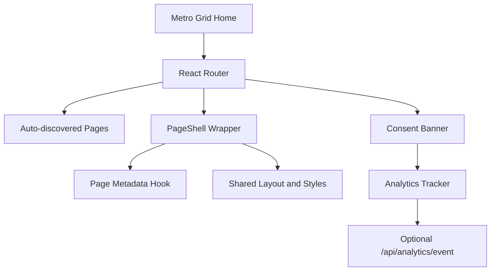

# MetroUI Website

An opinionated React + Vite portfolio built around a Metro-inspired tile system, animated route transitions, and a clean single-page deployment model.

This repository also includes `cabo/`, a separate real-time card game app that can be deployed alongside the main site from the same root `docker-compose.yml`.

## At a Glance

| Area | Notes |
| --- | --- |
| Frontend stack | React 18, TypeScript, Vite, React Router, Framer Motion |
| Routing model | File-based page discovery via `import.meta.glob("./pages/**/*.tsx")` |
| UI approach | Metro tile dashboard, shared `PageShell`, responsive `--mu` sizing system |
| Privacy | Consent-gated analytics and local browser storage for profile/preferences |
| Deployment | Static build, Docker image, or Compose with the bundled Cabo app |

## Jump To

- [Why This Repo Exists](#why-this-repo-exists)
- [Project Structure](#project-structure)
- [Local Development](#local-development)
- [Environment Notes](#environment-notes)
- [Deployment Paths](#deployment-paths)
- [Cabo App](#cabo-app)
- [Architecture Notes](#architecture-notes)

## Why This Repo Exists

The main app is a personal site with a stronger visual point of view than a standard portfolio template. Instead of a marketing-style landing page, the homepage behaves like a Metro board: tiles act as navigation, content pages are discovered from the filesystem, and transitions are handled centrally so the site stays lightweight to maintain as new pages are added.

## Project Structure

```text
.
|-- src/
|   |-- components/         # shared UI, top bar, compliance, analytics
|   |-- data/               # tile definitions and page icon data
|   |-- hooks/              # page metadata and profile state
|   |-- lib/                # lightweight API helpers
|   |-- pages/              # auto-registered route files
|   `-- styles/             # reset, theme, layout, metro, shell styles
|-- public/                 # static assets, robots.txt, sitemap.xml
|-- ops/                    # nginx config and deployment notes
|-- cabo/                   # separate Vite + Node WebSocket app
|-- Dockerfile
`-- docker-compose.yml
```

<details>
<summary><strong>Route generation details</strong></summary>

The root app does not maintain a hand-written route table for content pages. Files under `src/pages/**/*.tsx` are discovered automatically and converted into routes:

- `src/pages/About.tsx` -> `/about`
- `src/pages/profile/index.tsx` -> `/profile`
- `src/pages/profile/edit.tsx` -> `/profile/edit`

Every discovered page is wrapped in `PageShell`, while `/` stays mapped to the Metro tile grid.
</details>

<details>
<summary><strong>What is already implemented</strong></summary>

- Animated page transitions with `AnimatePresence`
- Shared metadata updates via `usePageMeta`
- Consent banner with explicit analytics opt-in
- Client-side profile persistence through `localStorage`
- Optional API helpers for analytics and future authenticated profile sync
</details>

## Local Development

### Main site

```bash
npm ci
npm run dev
```

Then open the Vite dev server shown in the terminal.

### Production build preview

```bash
npm run build
npm run preview
```

## Environment Notes

The frontend reads `VITE_API_BASE_URL` from the environment when present. If it is omitted, API calls default to same-origin requests.

Example:

```env
VITE_API_BASE_URL=https://example.com
```

There is currently no committed `.env.example` in the repo, so if you want a reproducible team setup, adding one would be a good next cleanup step.

## Deployment Paths

### 1. Static Vite build

Best when the site is being served as a plain frontend.

```bash
npm ci
npm run build
```

Build output lands in `dist/`.

For the existing phone/nginx/cloudflared workflow, see [ops/static-deploy.md](/E:/git/MetroUI_Website/ops/static-deploy.md).

### 2. Docker

The root `Dockerfile` contains two runtime targets:

- `metro-runtime` serves the main site through nginx
- `cabo-runtime` serves the Cabo frontend plus its Node WebSocket server

### 3. Docker Compose

```bash
docker compose up -d --build
```

By default:

- Main site: `http://localhost:3001`
- Cabo app: `http://localhost:3002`

The helper script below wraps the standard restart flow:

```bash
./deploy.sh
```

## Cabo App

`cabo/` is a separate project packaged inside this repository. It is not part of the main portfolio bundle.

Its stack is:

- React + Vite client
- Lightweight Node server
- Native WebSocket transport
- Shared TypeScript contracts between client and server

Useful commands:

```bash
cd cabo
npm ci
npm run dev
npm run dev:server
npm run test
```

For the app-specific notes, see [cabo/README.md](/E:/git/MetroUI_Website/cabo/README.md).

## Architecture Notes



<details>
<summary><strong>Frontend behavior worth knowing</strong></summary>

- `src/main.tsx` calculates a responsive `--mu` CSS variable from viewport size on startup and resize.
- `src/lib/api.ts` injects `Authorization` when a local token exists and supports same-origin or external API bases.
- `src/hooks/useProfile.ts` currently uses `localStorage` as the source of truth and already includes a TODO for authenticated API sync.
- Analytics failures are intentionally swallowed so browsing is never blocked by telemetry.
</details>

## Working On This Repo

- Add new top-level content pages by creating files in `src/pages/`.
- Add nested sections by creating folders with `index.tsx` and child pages.
- Keep content pages focused; layout and chrome belong in shared components.
- If you introduce new environment variables, document them here and add a `.env.example`.

## Status

This README reflects the repository state as of August 28, 2026.
